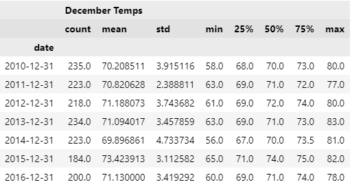

# Module 9 Challenge
There is business interest in opening a surf and ice cream shop business year-round in Oahu, HI. Before making such a decision, further reserach and analysis is required to determine whether the temperature trends throughout the year are suitable for such a business.

## Overview of Analysis
To determine the suitability of the weather, temperature data were collected for June and December to best represent the summer and winter seasons, irrespectively. Data for these two months were collected over a period of six (6) years from 2010 thru 2016. The following specific tasks were completed.
* Deliverable 1: Obtain statistical data regarding June temperatures in Oahu, HI
* Deliverable 2: Obtain statistical data regarding December temperatures in Oahu, HI
* Deliverable 3: Provide an analysis of the data

## Results
### June Temperatures Stats - 2010 thru 2016

### June Temperatures Stats by Year

### December Temperatures Stats - 2010 thru 2016

### December Temperatures Stats by Year

### Combined Average Temperatures

### Line Chart Comparting June and December Temperatures

### Key Differences Between June and December

* It seems that temperatures between June and December do not vary too much. There should be plenty of tourist needing to eat ice cream. There is only a 3 to 5 degree difference on average between June and December. 
* Minimum temperatures between June and December do seem to defer more drastically. When the temperatures in December dip, they tend to dip much further than in June.
* It seems summer temperatures over the years have started to increase since 2011. Major fluctuations occuring in December with record lows and records highs between 2014 and 2015.

## Summary
It seems that a year round surf and ice-cream shop is vary viable in Oahu, HI. The temperatures stay pretty even, with slight chances of December dipping down lower. There may be less business during the deep winter months. Possible other queries to perform would be:

* To identify the precipitation over the years during each season. Is there a rainy season?
* We should also pull temperatures for the entire year to determine when seasons have changed over the years. How many months is spring, summer, fall and winter. Same thing with preciptitation. we should plot the precipitation over the year.

## Resources
- Data Source: hawaii.sqlite database
- Software: Python 3.9.12, Jupyterlab 3.3.2, Pandas 1.4.2, numpy 1.21.5, sqlalchemy 1.4.32, matplotlib 3.5.1
